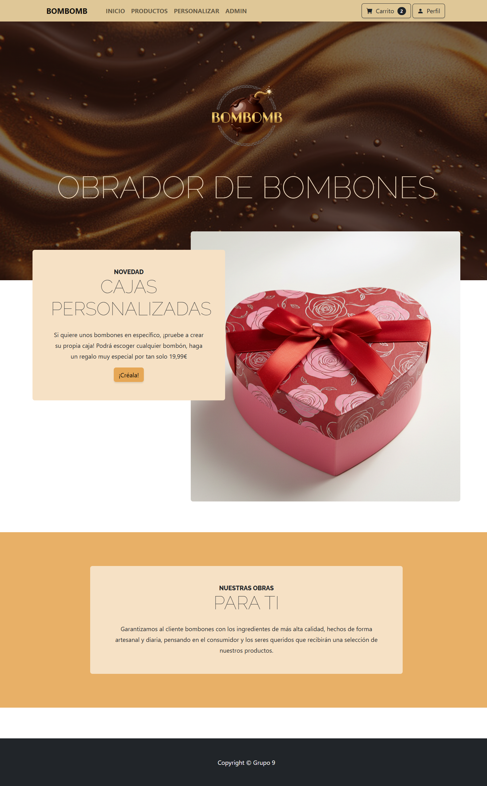
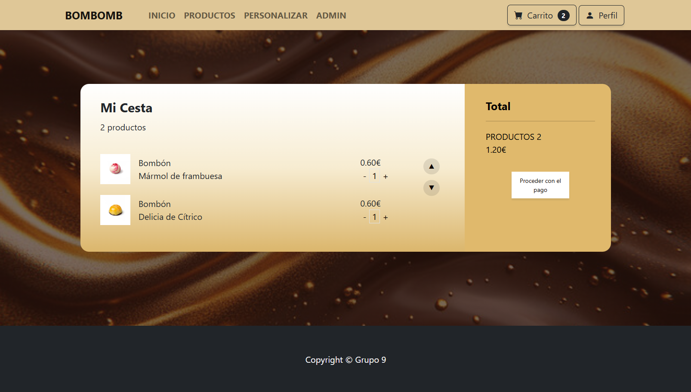
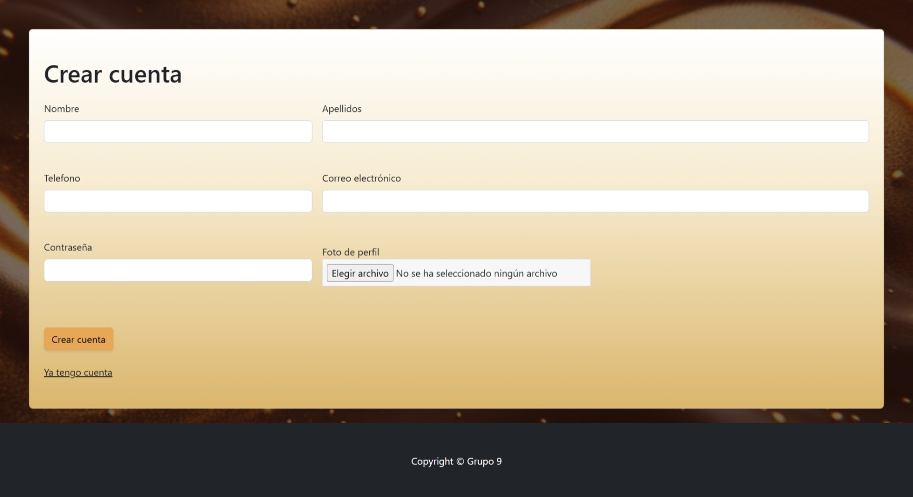
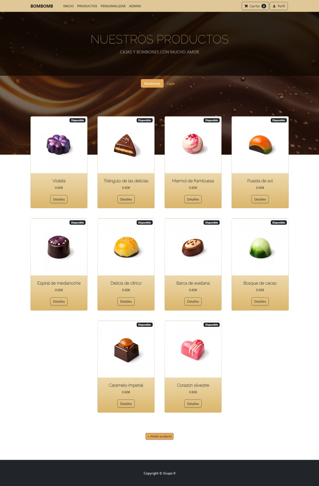

# BOMBOMB

## 👥 Miembros del Equipo
| Nombre y Apellidos | Correo URJC | Usuario GitHub |
|:--- |:--- |:--- |
| Sandra García Rodríguez | s.garciaro.2024@alumnos.urjc.es | sagarUr |
| Inés Uclés Ortiz | i.ucles.2024@alumnos.urjc.es | iness1899 |
| Ángela Briceño Ramírez | a.briceno.2024@alumnos.urjc.es | angelaurjc |
| Ainoa Acosta Sánchez | a.acosta.2024@alumnos.urjc.es | Ainoa-AS |

---

## 🎭 **Preparación: Definición del Proyecto**

### **Descripción del Tema**
Nuestra aplicación consiste en una tienda de bombones, donde el usuario puede elegir entre bombones sueltos o cajas de bombones. Dentro de las cajas, el usuario puede elegir entre una predeterminada, personalizada o elegirla aleatoriamente.

### **Entidades**
Indicar las entidades principales que gestionará la aplicación y las relaciones entre ellas:

1. **[Entidad 1]**: USER
2. **[Entidad 2]**: BOX
3. **[Entidad 3]**: CHOCOLATE
4. **[Entidad 4]**: ORDER

**Relaciones entre entidades:**
- User - Order: Un User puede tener múltiples Order (1:N)
- Box - Chocolate: Un Box puede tener múltiples Chocolates (1:N)
- Order - Box: Un Order puede contener múltiples Boxes y un Box puede estar en múltiples Orders (N:M)
- Order - Chocolate: Un Order puede contener múltiples Chocolates y un Chocolate puede estar en múltiples Orders (N:M)

### **Permisos de los Usuarios**
Describir los permisos de cada tipo de usuario e indicar de qué entidades es dueño:

* **Usuario Anónimo**: 
  - Permisos: navegación por la página de inicio, visualización de catálogo y productos y registro.
  - No es dueño de ninguna entidad

* **Usuario Registrado**: 
  - Permisos: gestión de su perfil, realizar pedido y crear caja personalizada o aleatoria.
  - Es dueño de: sus pedidos y su perfil.

* **Administrador**: 
  - Permisos: gestión de productos, visualizacion de pedidos y moderación de usuarios.
  - Es dueño de: bombones, cajas, usuarios y pedidos.

### **Imágenes**
Indicar qué entidades tendrán asociadas una o varias imágenes:

- **[Entidad con imágenes 1]**:  User - Una imagen de avatar por User
- **[Entidad con imágenes 2]**: Box - Una imagen por Box
- **[Entidad con imágenes 3]**: Chocolate - Una imagen por Chocolate

---

## 🛠 **Práctica 1: Maquetación de páginas con HTML y CSS**

### **Vídeo de Demostración**
📹 **[Enlace al vídeo en YouTube](https://www.youtube.com/watch?v=x91MPoITQ3I)**
> Vídeo mostrando las principales funcionalidades de la aplicación web.

### **Diagrama de Navegación**
Diagrama que muestra cómo se navega entre las diferentes páginas de la aplicación:


> [Descripción opcional del flujo de navegación: Ej: "El usuario puede acceder desde la página principal a todas las secciones mediante el menú de navegación. Los usuarios anónimos solo tienen acceso a las páginas públicas, mientras que los registrados pueden acceder a su perfil y panel de usuario."]

### **Capturas de Pantalla y Descripción de Páginas**

#### **1. Página Principal / Home**


> Página de inicio que muestra el logo y nombre del obrador, aparece la novedad de las cajas personalizables con un botón que nos lleva a ella y contiene un footer, una promesa de calidad hacia los clientes y una barra de navegación con el perfil, los productos, el carrito, lac cajas personalizables y una opción para el administrador.

#### **2. Página del Carrito / Cart**


> Aquí es donde se muestran los productos seleccionados por el usuario y su precio total, además de la opción de empezar a efectuar el pago.

#### **3. Página de Pago / Payment**


> En esta página, el usuario pondrá los detalles de la entrega e introducirá su tarjeta para el pago.

#### **4. Página de Éxito / Success**


> Podemos comprobar que el pago se ha realizado con éxito y nos da la opción de volver al incio.

#### **5. Página de Fallo / Fail**


> Por si ha habido algún problema con el pago, igualmente nos deja volver a la tienda.

#### **6. Página de Inicio de sesión/ Log in**


> Página para iniciar sesión, en caso de no tener cuenta se puede ir a la página de crear cuenta.

#### **7. Página de Crear cuenta/ Sign**


> Página para crear cuenta, en caso de ya tener cuenta se puede ir a la página de inicio de sesión.

#### **8. Página de perfil/ Profile**


> Página donde un usuario puede ver su perfil y su historial de pedidos, también puede editar su perfil y eliminarlo. El admin también tiene acceso a esta página para gestionar a los usuarios y sus pedidos.

#### **9. Página de productos/ Products**



> Página para ver los productos que se pueden comprar, tanto bombones como cajas, deja añadir productos al admin y que cualquiera pueda ver los detalles de algún producto específico.

#### **10. Página de Detalles de productos/ Product Details**


> Página para ver los detalles de los productos y desde donde el admin puede meterse a editar los detalles.


#### **11. Página de lista de usuarios**


> Página para ver la lista de usuarios y poder meterse a su perfil.


#### **12. Página de personalizar una caja**


> Página para crear una caja personalizada, pudiendo elegir caja y seleccionar los bombones que meter. También con la posibilidad de elegir bombones de forma aleatoria.

#### **13. Página de editar usuario**


> Página para editar un usuario.


#### **AQUÍ AÑADIR EL RESTO DE PÁGINAS**

### **Participación de Miembros en la Práctica 1**

#### **Alumno 1 - [Nombre Completo]**

[Descripción de las tareas y responsabilidades principales del alumno en el proyecto]

| Nº    | Commits      | Files      |
|:------------: |:------------:| :------------:|
|1| [Descripción commit 1](URL_commit_1)  | [Archivo1](URL_archivo_1)   |
|2| [Descripción commit 2](URL_commit_2)  | [Archivo2](URL_archivo_2)   |
|3| [Descripción commit 3](URL_commit_3)  | [Archivo3](URL_archivo_3)   |
|4| [Descripción commit 4](URL_commit_4)  | [Archivo4](URL_archivo_4)   |
|5| [Descripción commit 5](URL_commit_5)  | [Archivo5](URL_archivo_5)   |

---

#### **Alumno 2 - [Ángela Briceño Ramírez.]**

He creado la página de productos, la de detalles de producto, la de editar producto y crear producto. He generado, editado y separado las imágenes de los bombones, que posteriormente subió Inés. He modificado ligeramente estilos en el archivo css. He grabado el vídeo de explicación y muestra de funcionamiento de la página web.

| Nº    | Commits      | Files      |
|:------------: |:------------:| :------------:|
|1| [Página de productos y página de detalles de producto](https://github.com/DWS-2026/project-grupo-9/commit/edfdbfbb9f7e1099b54c5374cd7f84ed33158288)  | [Página productos](html/productsPage.html)   |
|2| [Primera unificación del CSS](https://github.com/DWS-2026/project-grupo-9/commit/fd59604f3ece3cf1c279c43be2dac62b65dff4e1)  | [Página detalles](html/productDetailsPage.html)   |
|3| [Página de editar producto](https://github.com/DWS-2026/project-grupo-9/commit/1d9e470e897477e1145103082ad5e025808f4a4d)  | [Página editar producto](html/editProductPage.html)   |
|4| [Página de crear producto](https://github.com/DWS-2026/project-grupo-9/commit/c9acf94227941ea3b130bd075ed5abbe42c445df)  | [Página crear producto](html/createProduct.html)   |
|5| [Descripción commit 5](URL_commit_5)  | [Archivo5](URL_archivo_5)   |

---

#### **Alumno 3 - Inés Uclés Ortiz**

Creación de las páginas de inicio, carrito, pago, éxito y fallo.

| Nº    | Commits      | Files      |
|:------------: |:------------:| :------------:|
|1| [Página del carrito](https://github.com/DWS-2026/project-grupo-9/commit/2e3c52f8b93e8cbb4c59f0cfc3da6668281d911d)  | [Archivo1](html/cart.html)   |
|2| [Página de inicio](https://github.com/DWS-2026/project-grupo-9/commit/937857bb5fab4a11b4fce405a17b9a112d19c5db)  | [Archivo2](html/index.html)   |
|3| [Página de pago](https://github.com/DWS-2026/project-grupo-9/commit/892bfece3c95d598e31da7013e92b3fac8cc2102)  | [Archivo3](html/payment.html)   |
|4| [Página de fallo](https://github.com/DWS-2026/project-grupo-9/commit/bae6fc26f2933c219ea4ae9eaaa8b7a6512739e3)  | [Archivo4](html/fail.html)   |
|5| [Página de éxito](https://github.com/DWS-2026/project-grupo-9/commit/0efdd30730614b69c7427166c517dcb7f64af76e)  | [Archivo5](html/success.html)   |

---

#### **Alumno 4 - Sandra García Rodríguez**

[Descripción de las tareas y responsabilidades principales del alumno en el proyecto]

| Nº    | Commits      | Files      |
|:------------: |:------------:| :------------:|
|1| [Descripción commit 1](URL_commit_1)  | [Archivo1](URL_archivo_1)   |
|2| [Descripción commit 2](URL_commit_2)  | [Archivo2](URL_archivo_2)   |
|3| [Descripción commit 3](URL_commit_3)  | [Archivo3](URL_archivo_3)   |
|4| [Descripción commit 4](URL_commit_4)  | [Archivo4](URL_archivo_4)   |
|5| [Descripción commit 5](URL_commit_5)  | [Archivo5](URL_archivo_5)   |

---

## 🛠 **Práctica 2: Web con HTML generado en servidor**

### **Vídeo de Demostración**
📹 **[Enlace al vídeo en YouTube](https://www.youtube.com/watch?v=x91MPoITQ3I)**
> Vídeo mostrando las principales funcionalidades de la aplicación web.

### **Navegación y Capturas de Pantalla**

#### **Diagrama de Navegación**

Solo si ha cambiado.

#### **Capturas de Pantalla Actualizadas**

Solo si han cambiado.

### **Instrucciones de Ejecución**

#### **Requisitos Previos**
- **Java**: versión 21 o superior
- **Maven**: versión 3.8 o superior
- **MySQL**: versión 8.0 o superior
- **Git**: para clonar el repositorio

#### **Pasos para ejecutar la aplicación**

1. **Clonar el repositorio**
   ```bash
   git clone https://github.com/[usuario]/[nombre-repositorio].git
   cd [nombre-repositorio]
   ```

2. **AQUÍ INDICAR LO SIGUIENTES PASOS**

#### **Credenciales de prueba**
- **Usuario Admin**: usuario: `admin`, contraseña: `admin`
- **Usuario Registrado**: usuario: `user`, contraseña: `user`

### **Diagrama de Entidades de Base de Datos**

Diagrama mostrando las entidades, sus campos y relaciones:


> [Descripción opcional: Ej: "El diagrama muestra las 4 entidades principales: Usuario, Producto, Pedido y Categoría, con sus respectivos atributos y relaciones 1:N y N:M."]

### **Diagrama de Clases y Templates**

Diagrama de clases de la aplicación con diferenciación por colores o secciones:


> [Descripción opcional del diagrama y relaciones principales]

### **Participación de Miembros en la Práctica 2**

#### **Alumno 1 - [Nombre Completo]**

[Descripción de las tareas y responsabilidades principales del alumno en el proyecto]

| Nº    | Commits      | Files      |
|:------------: |:------------:| :------------:|
|1| [Descripción commit 1](URL_commit_1)  | [Archivo1](URL_archivo_1)   |
|2| [Descripción commit 2](URL_commit_2)  | [Archivo2](URL_archivo_2)   |
|3| [Descripción commit 3](URL_commit_3)  | [Archivo3](URL_archivo_3)   |
|4| [Descripción commit 4](URL_commit_4)  | [Archivo4](URL_archivo_4)   |
|5| [Descripción commit 5](URL_commit_5)  | [Archivo5](URL_archivo_5)   |

---

#### **Alumno 2 - [Nombre Completo]**

[Descripción de las tareas y responsabilidades principales del alumno en el proyecto]

| Nº    | Commits      | Files      |
|:------------: |:------------:| :------------:|
|1| [Descripción commit 1](URL_commit_1)  | [Archivo1](URL_archivo_1)   |
|2| [Descripción commit 2](URL_commit_2)  | [Archivo2](URL_archivo_2)   |
|3| [Descripción commit 3](URL_commit_3)  | [Archivo3](URL_archivo_3)   |
|4| [Descripción commit 4](URL_commit_4)  | [Archivo4](URL_archivo_4)   |
|5| [Descripción commit 5](URL_commit_5)  | [Archivo5](URL_archivo_5)   |

---

#### **Alumno 3 - [Nombre Completo]**

[Descripción de las tareas y responsabilidades principales del alumno en el proyecto]

| Nº    | Commits      | Files      |
|:------------: |:------------:| :------------:|
|1| [Descripción commit 1](URL_commit_1)  | [Archivo1](URL_archivo_1)   |
|2| [Descripción commit 2](URL_commit_2)  | [Archivo2](URL_archivo_2)   |
|3| [Descripción commit 3](URL_commit_3)  | [Archivo3](URL_archivo_3)   |
|4| [Descripción commit 4](URL_commit_4)  | [Archivo4](URL_archivo_4)   |
|5| [Descripción commit 5](URL_commit_5)  | [Archivo5](URL_archivo_5)   |

---

#### **Alumno 4 - [Nombre Completo]**

[Descripción de las tareas y responsabilidades principales del alumno en el proyecto]

| Nº    | Commits      | Files      |
|:------------: |:------------:| :------------:|
|1| [Descripción commit 1](URL_commit_1)  | [Archivo1](URL_archivo_1)   |
|2| [Descripción commit 2](URL_commit_2)  | [Archivo2](URL_archivo_2)   |
|3| [Descripción commit 3](URL_commit_3)  | [Archivo3](URL_archivo_3)   |
|4| [Descripción commit 4](URL_commit_4)  | [Archivo4](URL_archivo_4)   |
|5| [Descripción commit 5](URL_commit_5)  | [Archivo5](URL_archivo_5)   |

---

## 🛠 **Práctica 3: Incorporación de una API REST a la aplicación web, análisis de vulnerabilidades y contramedidas**

### **Vídeo de Demostración**
📹 **[Enlace al vídeo en YouTube](https://www.youtube.com/watch?v=x91MPoITQ3I)**
> Vídeo mostrando las principales funcionalidades de la aplicación web.

### **Documentación de la API REST**

#### **Especificación OpenAPI**
📄 **[Especificación OpenAPI (YAML)](/api-docs/api-docs.yaml)**

#### **Documentación HTML**
📖 **[Documentación API REST (HTML)](https://raw.githack.com/[usuario]/[repositorio]/main/api-docs/api-docs.html)**

> La documentación de la API REST se encuentra en la carpeta `/api-docs` del repositorio. Se ha generado automáticamente con SpringDoc a partir de las anotaciones en el código Java.

### **Diagrama de Clases y Templates Actualizado**

Diagrama actualizado incluyendo los @RestController y su relación con los @Service compartidos:


#### **Credenciales de Usuarios de Ejemplo**

| Rol | Usuario | Contraseña |
|:---|:---|:---|
| Administrador | admin | admin123 |
| Usuario Registrado | user1 | user123 |
| Usuario Registrado | user2 | user123 |

### **Participación de Miembros en la Práctica 3**

#### **Alumno 1 - [Nombre Completo]**

[Descripción de las tareas y responsabilidades principales del alumno en el proyecto]

| Nº    | Commits      | Files      |
|:------------: |:------------:| :------------:|
|1| [Descripción commit 1](URL_commit_1)  | [Archivo1](URL_archivo_1)   |
|2| [Descripción commit 2](URL_commit_2)  | [Archivo2](URL_archivo_2)   |
|3| [Descripción commit 3](URL_commit_3)  | [Archivo3](URL_archivo_3)   |
|4| [Descripción commit 4](URL_commit_4)  | [Archivo4](URL_archivo_4)   |
|5| [Descripción commit 5](URL_commit_5)  | [Archivo5](URL_archivo_5)   |

---

#### **Alumno 2 - [Nombre Completo]**

[Descripción de las tareas y responsabilidades principales del alumno en el proyecto]

| Nº    | Commits      | Files      |
|:------------: |:------------:| :------------:|
|1| [Descripción commit 1](URL_commit_1)  | [Archivo1](URL_archivo_1)   |
|2| [Descripción commit 2](URL_commit_2)  | [Archivo2](URL_archivo_2)   |
|3| [Descripción commit 3](URL_commit_3)  | [Archivo3](URL_archivo_3)   |
|4| [Descripción commit 4](URL_commit_4)  | [Archivo4](URL_archivo_4)   |
|5| [Descripción commit 5](URL_commit_5)  | [Archivo5](URL_archivo_5)   |

---

#### **Alumno 3 - [Nombre Completo]**

[Descripción de las tareas y responsabilidades principales del alumno en el proyecto]

| Nº    | Commits      | Files      |
|:------------: |:------------:| :------------:|
|1| [Descripción commit 1](URL_commit_1)  | [Archivo1](URL_archivo_1)   |
|2| [Descripción commit 2](URL_commit_2)  | [Archivo2](URL_archivo_2)   |
|3| [Descripción commit 3](URL_commit_3)  | [Archivo3](URL_archivo_3)   |
|4| [Descripción commit 4](URL_commit_4)  | [Archivo4](URL_archivo_4)   |
|5| [Descripción commit 5](URL_commit_5)  | [Archivo5](URL_archivo_5)   |

---

#### **Alumno 4 - [Nombre Completo]**

[Descripción de las tareas y responsabilidades principales del alumno en el proyecto]

| Nº    | Commits      | Files      |
|:------------: |:------------:| :------------:|
|1| [Descripción commit 1](URL_commit_1)  | [Archivo1](URL_archivo_1)   |
|2| [Descripción commit 2](URL_commit_2)  | [Archivo2](URL_archivo_2)   |
|3| [Descripción commit 3](URL_commit_3)  | [Archivo3](URL_archivo_3)   |
|4| [Descripción commit 4](URL_commit_4)  | [Archivo4](URL_archivo_4)   |
|5| [Descripción commit 5](URL_commit_5)  | [Archivo5](URL_archivo_5)   |
